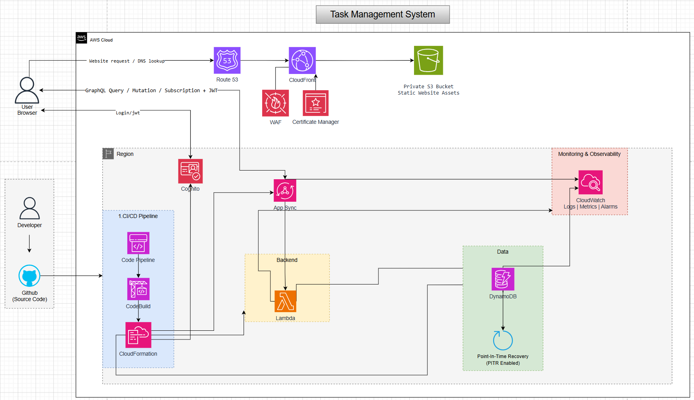

# Task Management System
## A Serverless AWS Architecture for Secure Task Collaboration

### 1. Executive Summary
The Task Management System is designed as a secure, scalable, and low-operations web application for creating, assigning, tracking, and updating work items in real time. The system uses a serverless AWS architecture so the project can focus on application features instead of server provisioning, patching, and capacity planning.

The frontend is delivered through Amazon CloudFront from a private Amazon S3 bucket, with Amazon Route 53 handling DNS, AWS Certificate Manager providing TLS, and AWS WAF protecting the public edge. Users authenticate through Amazon Cognito and send GraphQL queries, mutations, and subscriptions to AWS AppSync with JWT authorization. Business logic runs on AWS Lambda, task data is stored in Amazon DynamoDB with point-in-time recovery enabled, and operational logs, metrics, and alarms are centralized in Amazon CloudWatch. The deployment flow is automated from GitHub through AWS CodePipeline, AWS CodeBuild, and AWS CloudFormation.

### 2. Problem Statement
### What's the Problem?
Many small teams still manage tasks through chat messages, spreadsheets, or disconnected notes. This makes it difficult to know task ownership, current status, priority, and history. When the team grows, manual updates create duplicated information, missed deadlines, and limited visibility for project tracking.

Traditional web application hosting can also introduce unnecessary operational work for a student or internship project: server maintenance, manual deployment steps, database backup planning, SSL setup, and monitoring configuration.

### The Solution
The proposed system provides a centralized task management application backed by managed AWS services. Users sign in through Cognito, then interact with tasks through AppSync GraphQL APIs. Queries and mutations support task listing, creation, update, assignment, and completion. GraphQL subscriptions support near real-time updates so team members can see task changes without refreshing the page.

Lambda functions handle backend validation and workflow logic, while DynamoDB stores task records with scalable read/write capacity and point-in-time recovery. Static website assets stay private in S3 and are served only through CloudFront. CI/CD automation reduces manual deployment effort and keeps infrastructure changes repeatable through CloudFormation.

### Benefits and Return on Investment
The system improves team visibility by centralizing task data, status, ownership, and updates. Serverless services keep the operating model lightweight and cost-aware because most components scale with usage. Automated deployment shortens release time, reduces configuration mistakes, and makes the project easier to maintain after the internship period.

### 3. Solution Architecture
The architecture follows a serverless pattern with separated frontend delivery, authentication, API, backend, data, observability, and CI/CD layers. The public website request is resolved by Route 53 and delivered by CloudFront from a private S3 bucket. Login requests go through Cognito. Authenticated application requests use AppSync GraphQL with JWT tokens, then AppSync invokes Lambda for business logic and DynamoDB for persistent task data. CloudWatch collects logs, metrics, and alarms across the application.

### AWS Services Used
- **Amazon Route 53**: Manages DNS records for the application domain.
- **Amazon CloudFront**: Serves the frontend globally and connects users to the private S3 origin.
- **Amazon S3**: Stores static website assets in a private bucket.
- **AWS WAF**: Protects the CloudFront distribution against common web attacks.
- **AWS Certificate Manager**: Provides and manages the TLS certificate for HTTPS.
- **Amazon Cognito**: Handles user sign-up, sign-in, JWT token issuance, and authentication.
- **AWS AppSync**: Provides the GraphQL API for queries, mutations, and subscriptions.
- **AWS Lambda**: Runs backend task workflow logic without managing servers.
- **Amazon DynamoDB**: Stores task, user, status, and assignment data with point-in-time recovery enabled.
- **Amazon CloudWatch**: Collects logs, metrics, and alarms for monitoring and troubleshooting.
- **AWS CodePipeline**: Automates the deployment workflow from source code changes.
- **AWS CodeBuild**: Builds and validates application artifacts.
- **AWS CloudFormation**: Provisions and updates infrastructure as code.
- **GitHub**: Stores source code and triggers the CI/CD pipeline.

### Component Design
- **Frontend delivery**: Static frontend files are uploaded to a private S3 bucket and delivered through CloudFront. Route 53 maps the custom domain to the CloudFront distribution, and ACM enables HTTPS.
- **Security edge**: AWS WAF is attached to CloudFront to filter malicious or unexpected traffic before requests reach the application.
- **Authentication**: Cognito manages users and returns JWT tokens after login. The frontend attaches the token to GraphQL requests.
- **API layer**: AppSync validates the JWT token and exposes GraphQL operations for task creation, update, assignment, filtering, and real-time subscription events.
- **Backend logic**: Lambda functions implement business rules such as validating task ownership, updating task status, and preparing response payloads.
- **Data layer**: DynamoDB stores task data and enables point-in-time recovery to protect against accidental writes or deletes.
- **Operations**: CloudWatch receives logs and metrics from AppSync, Lambda, DynamoDB, and the deployment pipeline. Alarms can notify the team when errors or abnormal usage appear.
- **Deployment**: Developers push code to GitHub. CodePipeline and CodeBuild package the application, then CloudFormation updates AWS resources and deploys the frontend/backend changes.

### 4. Technical Implementation
**Implementation Phases**
- Requirement analysis and architecture design: Define user roles, task lifecycle, GraphQL operations, security boundaries, and AWS service responsibilities.
- Infrastructure as code setup: Create CloudFormation templates for S3, CloudFront, WAF, ACM, Cognito, AppSync, Lambda, DynamoDB, CloudWatch, and CI/CD resources.
- Frontend development: Build the task interface, authentication screens, task list, task detail, filters, and real-time update behavior.
- Backend and API development: Define GraphQL schema, connect resolvers to Lambda, implement validation logic, and integrate DynamoDB access patterns.
- Monitoring and security hardening: Configure CloudWatch logs, metrics, alarms, IAM least-privilege permissions, DynamoDB PITR, and WAF rules.
- Testing and deployment: Validate login, CRUD flows, subscription updates, CI/CD deployment, rollback behavior, and basic failure scenarios.

**Technical Requirements**
- A static web frontend that can be built and deployed to S3.
- Cognito user pool for authentication and JWT-based authorization.
- AppSync GraphQL schema covering task queries, mutations, and subscriptions.
- Lambda runtime for backend logic and DynamoDB integration.
- DynamoDB table design for tasks, users, projects, status, priority, and assignment access patterns.
- CloudFormation templates for repeatable infrastructure provisioning.
- CI/CD pipeline connected to GitHub for automated build and deployment.
- CloudWatch dashboards or alarms for error tracking and operational visibility.

### 5. Timeline and Milestones
**Project Timeline**
- Pre-implementation: Research AWS serverless services, compare architecture options, and finalize the project scope.
- Month 1: Design the solution architecture, define data model, create initial CloudFormation templates, and configure the basic frontend hosting path.
- Month 2: Implement Cognito authentication, AppSync GraphQL API, Lambda functions, and DynamoDB persistence.
- Month 3: Complete CI/CD, monitoring, WAF configuration, integration testing, documentation, and final project presentation.
- Post-launch: Improve UI/UX, add team/project grouping, enhance audit logging, and optimize cost based on real usage.

### 6. Budget Estimation
The project is designed for a small internship-scale workload, so most usage should stay within low-cost or free-tier levels. The final estimate should be recalculated in the [AWS Pricing Calculator](https://calculator.aws/) before deployment because AWS pricing depends on Region, traffic, and selected plans.

### Estimated Infrastructure Costs
- Route 53: approximately $0.50/month for one public hosted zone, plus DNS query charges if applicable.
- CloudFront and S3: expected to be very low for static assets and small traffic; CloudFront also offers a free plan with monthly usage allowances.
- Cognito: expected $0/month for a small internal user base within the monthly active user free tier.
- AppSync: expected $0/month during free-tier usage; beyond free tier, query/mutation and real-time operations are usage-based.
- Lambda: expected $0/month for low invocation volume within the Lambda free tier.
- DynamoDB: expected $0/month for a small table within free-tier storage/provisioned capacity, or low pay-per-request cost if using on-demand mode.
- CloudWatch: expected $0/month if logs, metrics, and alarms stay within the free tier.
- WAF: the main recurring security cost if enabled separately; estimate around $10-15/month for one Web ACL with a small rule set and low request volume.
- CodePipeline, CodeBuild, and CloudFormation: expected to remain low for a small CI/CD pipeline with limited builds.

**Estimated total**: around $1-3/month for the core low-traffic serverless application without separate WAF charges, or around $12-18/month with WAF enabled.

### 7. Risk Assessment
#### Risk Matrix
- Misconfigured authentication or authorization: High impact, medium probability.
- GraphQL resolver or Lambda errors: Medium impact, medium probability.
- DynamoDB access pattern mismatch: Medium impact, medium probability.
- Accidental data deletion or incorrect updates: High impact, low probability.
- Unexpected cost from WAF, logs, or traffic spikes: Medium impact, low probability.
- CI/CD deployment failure: Medium impact, medium probability.

#### Mitigation Strategies
- Apply least-privilege IAM permissions and validate Cognito JWT authorization in AppSync.
- Use structured logging and CloudWatch alarms for Lambda and AppSync errors.
- Design DynamoDB keys around real task access patterns before implementation.
- Enable DynamoDB point-in-time recovery and avoid direct manual writes in production.
- Configure AWS Budgets and review CloudWatch log retention settings.
- Keep infrastructure changes in CloudFormation and test the pipeline before final deployment.

#### Contingency Plans
- Roll back failed deployments through CloudFormation and CodePipeline.
- Restore DynamoDB records through point-in-time recovery if data is accidentally modified.
- Temporarily disable non-critical features such as subscriptions or WAF rules if they cause cost or availability issues during testing.
- Use manual deployment only as a short-term fallback while fixing the CI/CD pipeline.

### 8. Expected Outcomes
#### Technical Improvements
The final system provides a secure serverless task management application with managed authentication, real-time GraphQL updates, automated deployment, centralized monitoring, and resilient task data storage.

#### Long-term Value
The architecture can be reused as a foundation for future team collaboration tools, issue tracking systems, or internal workflow applications. It also demonstrates practical AWS skills across frontend hosting, identity, serverless backend, NoSQL data modeling, monitoring, security, and CI/CD automation.