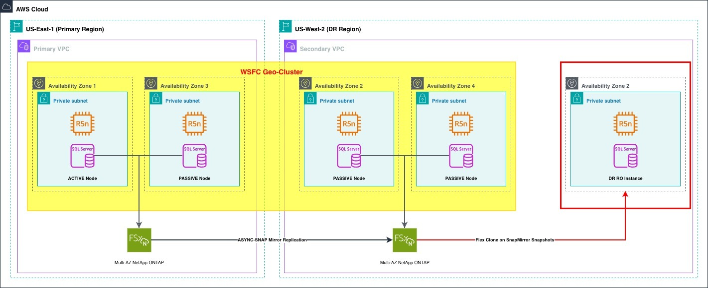

# S&P Global's Disaster Recovery strategy with Amazon FSx for NetApp ONTAP

While learning more about AWS, I read an interesting AWS Architecture Blog post about how S&P Global Market Intelligence built a **Disaster Recovery (DR)** strategy using **Amazon FSx for NetApp ONTAP**.

Before reading this article, I understood Disaster Recovery mostly as backing up data and restoring it when something goes wrong. This case study helped me realize that, in large systems, DR is much more than backup. It is also about designing a system that can keep serving users quickly when the primary environment or Region has an outage.

## Article overview

The article explains how S&P Global Market Intelligence implemented a DR solution for the Capital IQ platform. Because this platform serves financial data to global customers, availability, data consistency, Recovery Time Objective (RTO), and Recovery Point Objective (RPO) are critical.

The key highlight is that the system can fail over to a read-only DR environment in under 15 minutes. If full operation is required, the team can then move the DR environment to read-write mode through a controlled recovery process.

## Architecture

The solution uses a multi-Region design:

- **US-East-1** is the Primary Region.
- **US-West-2** is the DR Region.
- **SQL Server** runs on Amazon EC2 instances and is arranged with a Windows Server Failover Cluster model.
- **Each Region** has an Amazon FSx for NetApp ONTAP file system.
- **Data** is replicated from the Primary Region to the DR Region using SnapMirror.
- **FlexClone** creates a volume from the latest replicated snapshot in the DR Region, making data available for read-only access.

## Key components

### Amazon FSx for NetApp ONTAP

Amazon FSx for NetApp ONTAP is a managed file storage service that supports ONTAP capabilities such as snapshots, replication, and cloning. In this case study, it acts as the storage layer for SQL Server data that must be protected.

### Snapshots
Snapshots preserve the state of data at a specific point in time. They provide the foundation for recovery and testing without manually copying the entire dataset.

### SnapMirror
SnapMirror replicates data from the Primary Region to the DR Region. According to the article, replication is configured on a 15-minute schedule so the DR Region stays close to production.

### FlexClone
FlexClone is the most interesting part of the solution for me. Instead of rebuilding the environment from scratch, the system can create a clone from a replicated snapshot in the DR Region. This clone operates independently of the replication process, so it can serve read-only traffic while replication continues.

## Recovery process
The DR approach has two stages:

1. **Rapid read-only failover**: use snapshots and FlexClone to make a DR environment available quickly.
2. **Read-write recovery when needed**: stop writes in the Primary Region, apply a final SnapMirror update, break the replication relationship, and move SQL Server resources to the DR Region.
This design allows users to keep accessing critical data while the engineering team completes the full recovery workflow.

## What I learned

As a student learning AWS, this article helped me understand that cloud system design is not only about deploying an application. I also need to think about questions such as:

- What happens when the system fails?
- How much data could be lost in the worst case?
- Can users still access important data?
- How quickly does the system need to recover?
- Has the failover and fallback process been tested?
Disaster Recovery is a combination of architecture, data protection, operations, and process. Backup is important, but it is not enough by itself.

## Conclusion
I still do not fully understand every service and technique in the article, especially Amazon FSx for NetApp ONTAP, SnapMirror, and FlexClone. However, this case study is useful because it shows how a large system designs DR not only to restore data, but also to reduce downtime and maintain access for users.

Reference: https://aws.amazon.com/vi/blogs/architecture/sp-globals-innovative-disaster-recovery-strategy-using-amazon-fsx-for-netapp-ontap-snapshots/