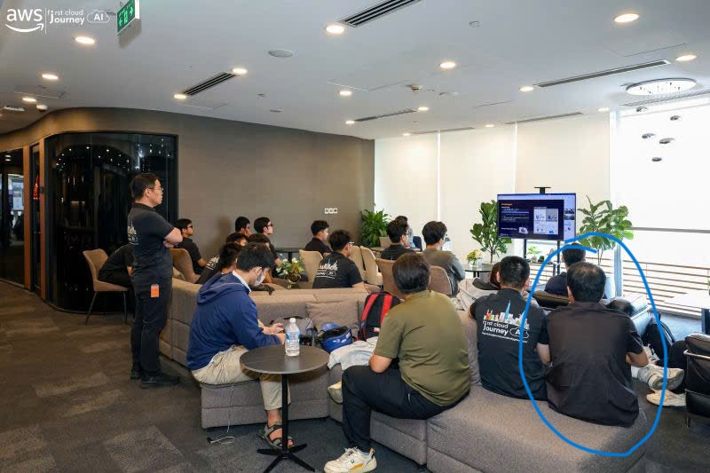

# Summary Report: “FCAJ Community Day - 23/05/2026”

### Event Overview

**FCAJ Community Day on 23/05/2026** was a full-day technology community event attended by students, developers, engineers, and people interested in artificial intelligence, cloud computing, software engineering, and career development.

The event focused on how AI is changing product development, system operations, and working processes within organizations. Instead of presenting only theoretical concepts, the speakers used real-world stories, technical demonstrations, project experiences, and practical implementation scenarios to explain each topic.

The event provided participants with a realistic perspective on the role of software engineers in the AI era. It also emphasized that new technologies only create meaningful value when they are applied to actual user and business needs.

### Event Objectives

- Share insights into how the software industry is changing in the AI era.
- Explain the continuing role of engineers as AI supports more development activities.
- Introduce Context Engineering and methods for creating prompts with sufficient context.
- Present practical applications of Amazon Q in enterprise environments.
- Share knowledge about Amazon CloudFront, security, and cost predictability.
- Provide experience in building a product within a limited period.
- Explain the factors that affect the consistency of large language models.
- Create opportunities for technology learners and professionals to connect and exchange ideas.

### Opening Session

The event began with a welcome session and a presentation about the future of software engineering as AI tools continue to develop.

The speaker explained that AI is reducing the time and cost required to build software products. Activities such as writing code, generating documentation, identifying errors, and developing prototypes can now be completed more quickly with AI assistance.

However, as software development becomes more accessible, the number of digital products is also expected to increase. Therefore, the demand for engineers who can understand business problems, design systems, deploy products, operate infrastructure, and resolve production issues will remain high.

The main message of the opening session was that AI may change how engineers work, but it does not reduce the importance of fundamental knowledge, systems thinking, and responsibility for the final product.

### Key Highlights

#### The Future of Work in the AI Era

The first session analyzed the impact of AI on software development and the technology job market.

As the cost of building software decreases, more organizations and individuals can experiment with new ideas in less time. This may lead to a significant increase in the number of applications, platforms, and digital services in the future.

Important points included:

- AI can accelerate code generation and prototype development.
- Repetitive tasks can be automated to a greater extent.
- Engineers should focus more on problem analysis and solution design.
- Knowledge of real-world systems remains essential.
- Organizations still need people who can move products from ideas to production.
- System operation, scaling, and maintenance cannot depend entirely on AI.

From this session, I learned that technology professionals should use AI as a supporting tool while continuing to strengthen their programming, system architecture, and business analysis skills.

#### Context Engineering and Prompt Design

Another session focused on **Context Engineering**, which is the process of providing AI with the information required to handle a request more accurately.

The speaker emphasized that an effective prompt is not only a clearly written question. To produce useful results in a real working environment, a prompt should also include the role, objective, relevant data, constraints, expected output format, and business context.

Important components of an effective prompt include:

- Defining the role that the AI should perform.
- Clearly describing the problem that needs to be solved.
- Providing project or business context.
- Identifying the intended audience of the result.
- Specifying the expected structure and output format.
- Providing examples when the request is highly specific.
- Including appropriate reference data.
- Defining any conditions or limitations that must be followed.

The session demonstrated that the same question can generate significantly more accurate and useful results when it is supported by suitable context.

This is especially important in technical workflows such as generating code, analyzing errors, writing documentation, creating test cases, and proposing system architectures.

#### Enterprise AI Assistants and Amazon Q

The next session introduced the use of AI assistants in enterprise environments, with **Amazon Q** presented as a practical tool for supporting various types of work.

Amazon Q can assist with:

- Searching for and summarizing information.
- Answering questions based on enterprise data.
- Writing and explaining source code.
- Generating reports from multiple data sources.
- Automating internal business processes.
- Supporting technical documentation tasks.
- Improving productivity in daily work.

In addition to speed and efficiency benefits, the speaker discussed several important requirements for introducing AI into an organization:

- Controlling access to data.
- Protecting confidential information.
- Monitoring AI system activities.
- Establishing usage policies and guardrails.
- Requiring human review for important outputs.
- Maintaining transparency in data processing.

This session helped me understand that adopting AI in an organization involves more than deploying a new tool. It also requires security, governance, accountability, and appropriate human supervision.

#### Amazon CloudFront, Security, and Cost Predictability

A technical session explained how **Amazon CloudFront** supports content delivery to users.

CloudFront uses a global network of edge locations to cache content closer to users. This reduces response times and limits the number of requests sent directly to the origin server.

The main benefits discussed included:

- Reducing latency when users access content.
- Reducing the workload on the origin server.
- Improving the system’s ability to handle traffic increases.
- Protecting the origin from direct public access.
- Improving system availability and reliability.
- Supporting more predictable operational costs.

The presentation showed that CloudFront is not only a performance optimization service but can also contribute to security and infrastructure cost management.

When traffic increases unexpectedly, delivering content through a content delivery network can help the system remain stable while reducing pressure on backend resources.

#### Building a Product During a 36-Hour Hackathon

One of the most memorable sessions described how a team developed a product within **36 hours**.

Instead of attempting to build a system with too many features, the team focused on a specific problem, identified the target users, and developed a prototype that clearly demonstrated the value of the idea.

Several important lessons were shared:

- Choose a meaningful and practical problem.
- Identify the most important product feature.
- Avoid spending too much time on secondary functions.
- Divide responsibilities clearly among team members.
- Build a prototype early to validate the idea.
- Review progress continuously throughout the development process.
- Prepare a concise presentation focused on the product’s value.

This story helped me understand that, within a limited period, defining the correct scope and focusing on core value are more important than attempting to build an overly complex product.

#### LLM Consistency and the Temperature Parameter

Another technical session explained why large language models may generate different responses even when users submit the same prompt.

One factor that affects the result is the **temperature** parameter. This parameter influences the amount of randomness used when the model selects the next word or response content.

When the temperature is set to a low value:

- Results are generally more stable.
- Responses have greater consistency.
- The configuration is suitable for tasks that require accuracy and repeatability.
- Creativity and response diversity are reduced.

When the temperature is set to a high value:

- Results may be more diverse.
- The configuration is suitable for idea generation.
- Responses may be more creative.
- The possibility of inconsistent outputs also increases.

The speaker emphasized that model settings in a production environment should be selected according to the purpose of the system.

For tasks such as creative writing or idea generation, diversity may be beneficial. However, for systems that process important data, support decisions, or automate business operations, reliability and consistency should be prioritized.

### Key Takeaways

#### The Role of Engineers in the AI Era

- AI can support code generation but cannot fully replace technical reasoning.
- Fundamental programming and system knowledge remain essential.
- Engineers must understand business problems before designing solutions.
- Production deployment and operation skills are increasingly important.
- Effective AI users must know how to review and evaluate generated outputs.

#### Prompt and Context Engineering

- A short prompt does not always produce an appropriate result.
- Sufficient context helps AI understand the actual objective.
- Prompts should define the role, task, constraints, and expected output.
- Practical examples can improve response accuracy.
- Context Engineering is important in technical workflows.

#### Applying AI in Enterprise Environments

- AI can support information retrieval, summarization, and task automation.
- Enterprise data must be protected when integrated with AI.
- Systems require guardrails and monitoring processes.
- Important results should be reviewed by humans.
- AI adoption should include responsibility and transparency.

#### System Architecture and Operations

- Amazon CloudFront can improve performance and reduce origin workload.
- A CDN can support security and system reliability.
- Scalability should be considered during the design stage.
- Cost management is part of building a production system.
- Production systems should prioritize stability and observability.

#### Product Development

- Product development should begin with a user problem rather than a technology.
- A small prototype that solves the correct problem can still provide significant value.
- Scope must be controlled when time and resources are limited.
- Teamwork and task allocation strongly affect progress.
- Early feedback helps teams improve the product in the correct direction.

### Applying to Work

After attending the event, I can apply the knowledge gained to my internship, studies, and future projects.

#### Improving AI Usage Skills

- Provide sufficient context when writing prompts.
- Clearly define the objective and expected output format.
- Divide complex tasks into smaller steps.
- Include suitable reference data in prompts.
- Review all AI-generated content.
- Adjust the temperature according to the task.
- Avoid using AI outputs for important decisions without verification.

#### Improving the Software Development Process

- Understand the problem before selecting a solution.
- Identify the most important feature of the product.
- Build an early prototype to evaluate feasibility.
- Focus on the value delivered by the product.
- Monitor progress and adjust the scope when necessary.
- Consider deployment and operation requirements from the beginning.

#### Applying AWS Knowledge

- Use CloudFront for content that must be delivered to many users.
- Prevent users from accessing the origin directly.
- Review security policies for AWS resources.
- Monitor service traffic and operating costs.
- Remove resources that are no longer needed.
- Consider scalability when designing the system.

#### Developing a Professional Mindset

- Strengthen programming and system architecture knowledge.
- Learn how to combine AI with professional technical skills.
- Focus on solving practical problems.
- Study production system operation in greater depth.
- Actively participate in community events.
- Exchange ideas with experienced professionals to gain additional perspectives.

### Event Experience

Attending **FCAJ Community Day on 23/05/2026** was a valuable experience because the event connected current AI trends with the practical requirements of software engineering and cloud computing.

#### Practical and Relevant Content

The sessions did not only present the capabilities of AI. They also discussed the limitations, risks, and requirements involved in introducing AI into real-world systems.

As a result, I understood that adopting a new technology should be planned carefully and based on actual needs rather than simply following a trend.

#### A Clearer Understanding of the Engineer’s Role

The session about the future of work helped me understand that software engineers continue to play an important role in designing, deploying, operating, and maintaining products.

AI can accelerate some activities, but engineers remain responsible for system quality, security, and reliability.

#### A Deeper Understanding of Prompts and Context

The Context Engineering session changed the way I use AI tools.

Instead of submitting only a short question, I should clearly provide the objective, relevant data, intended audience, and expected output to receive more appropriate results.

#### Learning About Enterprise AI Tools

The Amazon Q session helped me understand how AI can support different activities in an enterprise environment.

At the same time, I became more aware of the importance of security, permissions, and monitoring when AI systems access internal data.

#### Additional Knowledge About CloudFront

The technical session about CloudFront helped me connect the knowledge gained from AWS labs with the way the service is used in real systems.

I developed a clearer understanding of the role of a CDN in performance, scalability, security, and operational cost management.

#### Learning from the Hackathon Experience

The story of developing a product within 36 hours provided useful lessons about scope control, teamwork, and prototype development.

The session demonstrated that a simple product that solves the correct problem can be more convincing than a complex system without a clear objective.

#### Understanding AI Reliability

The session about temperature and LLM consistency helped me understand that AI responses are not always identical.

When building AI-powered features, developers need to select suitable settings, perform repeated evaluations, and implement mechanisms for reviewing the outputs.

### Lessons Learned

- AI can improve productivity, but users remain responsible for controlling the results.
- Fundamental technical knowledge remains valuable in the AI era.
- Effective prompts require sufficient context and clear requirements.
- Technology products should be built around practical problems.
- Enterprise systems require AI security and monitoring mechanisms.
- Consistency is essential for production AI applications.
- CloudFront can support performance, security, and cost optimization.
- A small and clearly defined scope helps teams build prototypes more quickly.
- Technical decisions should balance creativity with reliability.
- Learning from the technology community helps expand knowledge and career perspectives.

