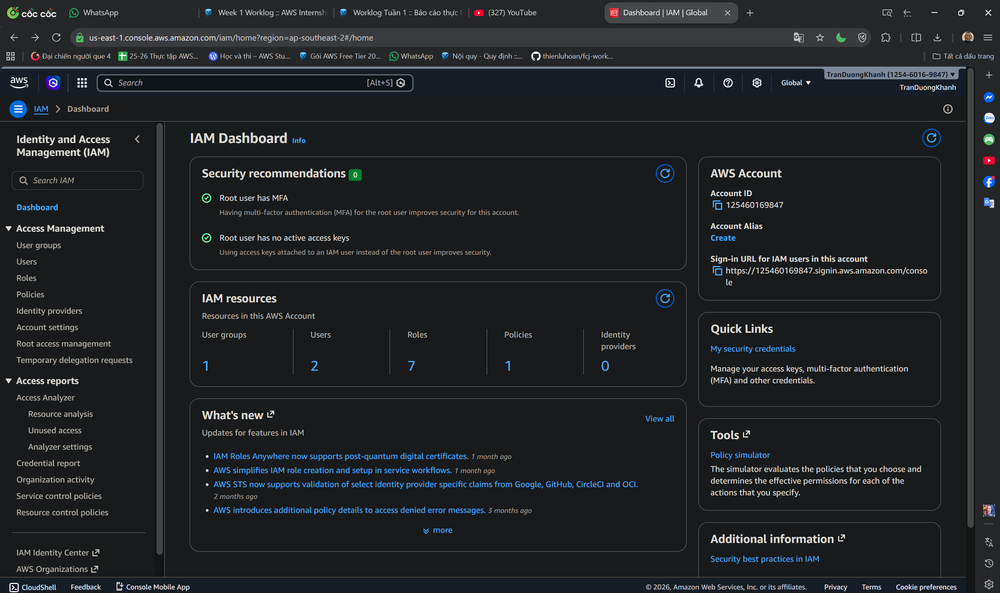

#### Mục tiêu

Phần này sẽ kiểm tra tài khoản AWS, khu vực, quyền IAM và các điều kiện cần thiết trước khi xem xét hệ thống TaskManager.

### Khu vực

Workshop sử dụng khu vực **Asia Pacific (Singapore) - ap-southeast-1** cho các dịch vụ chính: Cognito, AppSync, Lambda, DynamoDB, S3 và CloudWatch.

### Kiểm tra IAM

1. Mở AWS Management Console.
2. Tìm kiếm dịch vụ IAM.
3. Kiểm tra bảng điều khiển IAM để xác nhận tài khoản đã có các biện pháp bảo mật cơ bản.

Bảng điều khiển cho thấy MFA đã được bật cho người dùng root và không có access key nào của tài khoản root đang hoạt động. Đây là những khuyến nghị bảo mật quan trọng đối với một tài khoản AWS.

### Các quyền cần thiết

Người dùng IAM hoặc IAM role được sử dụng trong workshop này cần có quyền truy cập vào các dịch vụ sau:

- Amazon S3: tải các tài nguyên frontend lên.
- Amazon Cognito: kiểm tra cấu hình User Pool và App Client.
- AWS AppSync: kiểm tra GraphQL API, endpoint và phương thức xác thực.
- AWS Lambda: kiểm tra danh sách hàm và cấu hình môi trường thực thi.
- Amazon DynamoDB: kiểm tra các bảng, chỉ mục, chế độ dung lượng và PITR.
- Amazon CloudWatch: kiểm tra các log group và log stream.
- IAM: kiểm tra các role và policy liên quan đến Lambda, AppSync và quá trình triển khai.

### Quy tắc đặt tên tài nguyên

Các tài nguyên trong workshop sử dụng hậu tố `dev` cho môi trường phát triển:

- `taskmanager-frontend-dev-*`
- `taskmanager-users-dev`
- `TaskManagerAPI-dev`
- `userManager-dev`
- `boardManager-dev`
- `taskProcessor-dev`
- `streamProcessor-dev`
- `TaskManager-Boards-dev`
- `TaskManager-Tasks-dev`
- `TaskManager-Users-dev`

### Danh sách kiểm tra điều kiện cần thiết

- Đăng nhập đúng tài khoản AWS.
- Chọn khu vực `ap-southeast-1`.
- Xác nhận người dùng IAM hoặc IAM role có thể xem các tài nguyên cần thiết.
- Chuẩn bị thư mục build của frontend, bao gồm `index.html`, JavaScript bundle, CSS bundle và các tài nguyên SVG tĩnh.