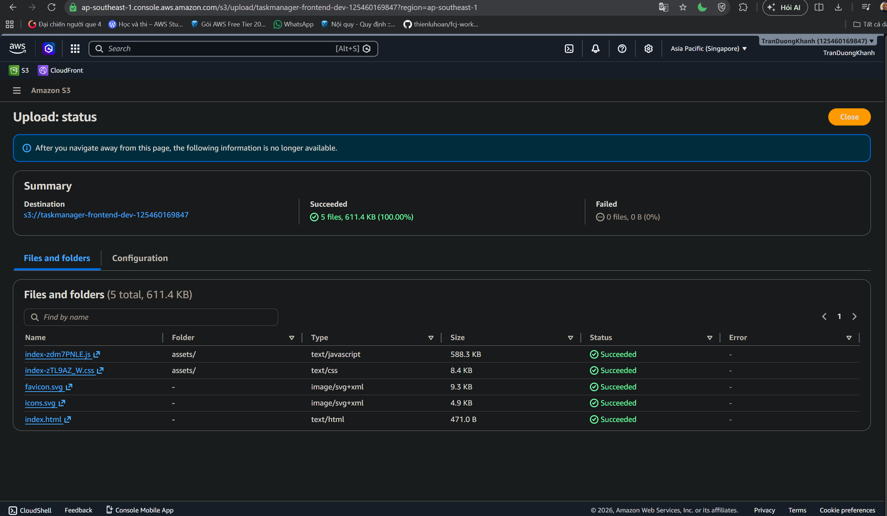

#### Overview

The TaskManager frontend is a static web application. After the build step, HTML, JavaScript, CSS, and SVG files are uploaded to the `taskmanager-frontend-dev-*` **Amazon S3 bucket**.

In a production architecture, the S3 bucket should stay private and be served through CloudFront. In this workshop, we focus on validating that the frontend artifacts were uploaded successfully to S3.

#### Content

- [Upload frontend assets to S3](5.3.1/)
- [Validate the frontend upload result](5.3.2/)