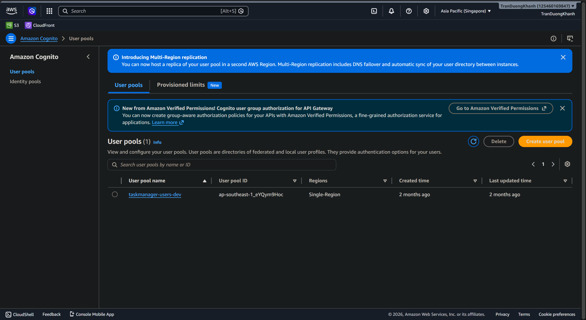
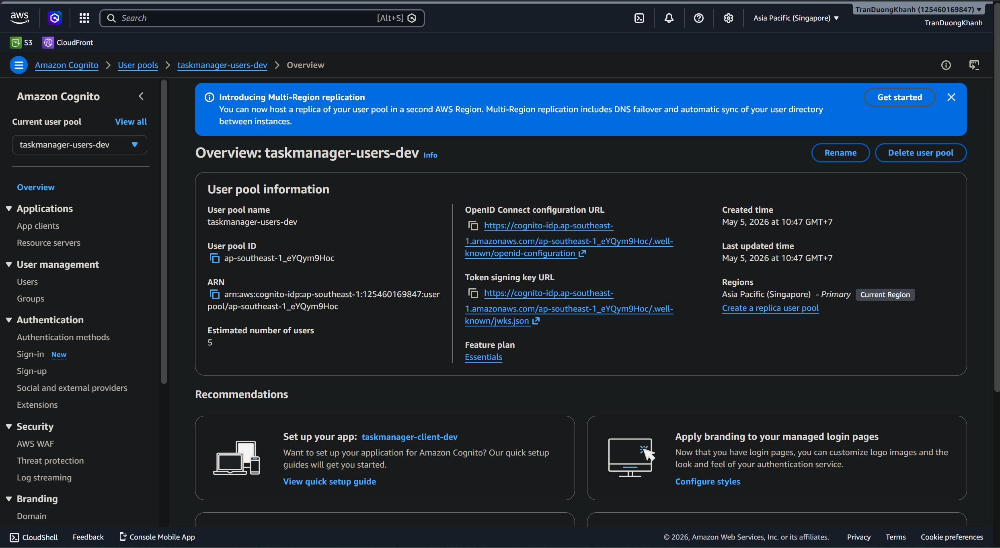

### Goal
Verify that Amazon Cognito User Pool is used as the authentication layer for TaskManager.

### Check the User Pool list

1. Open the Amazon Cognito console.
2. Choose User pools.
3. Confirm that the `taskmanager-users-dev` user pool exists.

The screenshot shows one user pool named `taskmanager-users-dev` in the `ap-southeast-1` Region.

### Check User Pool information

Open the `taskmanager-users-dev` user pool and review the Overview tab.

Important details:

- User pool name: `taskmanager-users-dev`
- User pool ID: `ap-southeast-1_eYQym9Hoc`
- Estimated number of users: `5`
- App client: `taskmanager-client-dev`
- Feature plan: `Essentials`
- Region: Asia Pacific (Singapore)

### Role in the system
Cognito is responsible for:

- Managing application users.
- Issuing JWT tokens.
- Providing the OIDC configuration URL and token signing key URL.
- Acting as the primary authentication mode for the AppSync API.

### Conclusion
The User Pool has been created and is ready for frontend sign-in and authentication flows.

