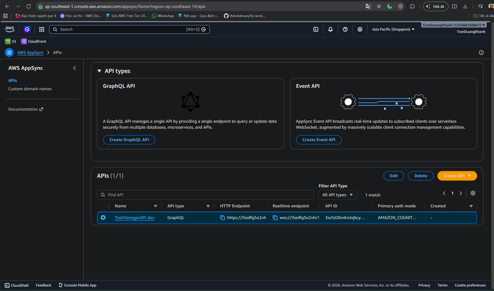

### Goal

Verify that the AWS AppSync API is available for frontend GraphQL queries, mutations, and subscriptions.

### Check the API

1. Open the AWS AppSync console.
2. Choose APIs.
3. Confirm that `TaskManagerAPI-dev` exists.

The screenshot shows one AppSync API:

- Name: `TaskManagerAPI-dev`
- API type: GraphQL
- Primary auth mode: Amazon Cognito
- HTTP endpoint: HTTPS endpoint for queries and mutations
- Realtime endpoint: WebSocket endpoint for subscriptions

### AppSync role

- Query: retrieve boards, tasks, users, or notifications.
- Mutation: create, update, or delete task, board, or user data.
- Subscription: receive real-time updates when tasks change.
- Authorization: validate requests using Cognito JWT tokens.\

### Conclusion
The GraphQL API has been created successfully and uses Cognito as the primary authentication mode.

