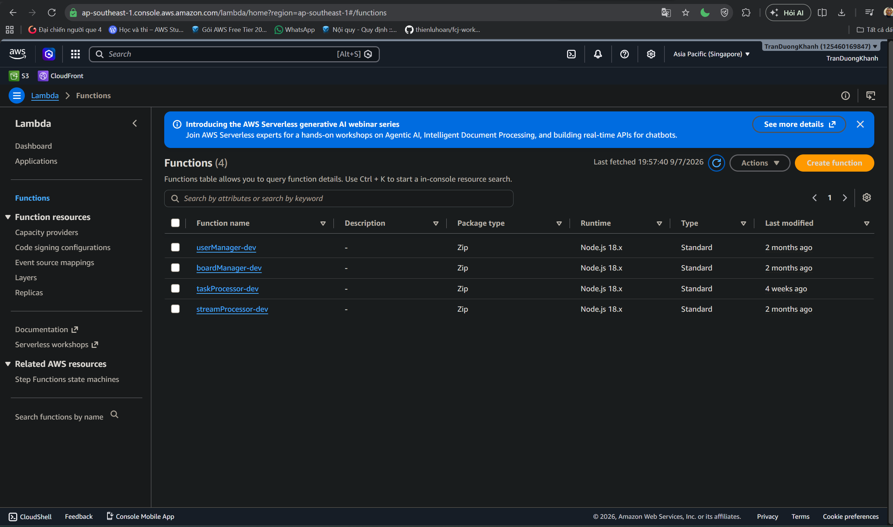

#### Goal

Verify that the Lambda functions for TaskManager backend logic have been deployed.

### Check the function list
1. Open the AWS Lambda console.
2. Choose Functions.
3. Review the functions that belong to the TaskManager project.

Deployed functions:

- `userManager-dev`: handles user and profile data.
- `boardManager-dev`: handles boards, board members, and access rules.
- `taskProcessor-dev`: handles task lifecycle operations such as create, update, and status changes.
- `streamProcessor-dev`: handles stream events for updates or activity logging.

### Runtime and package
The screenshot shows:

- Package type: `Zip`
- Runtime:`Node.js 18.x`
- Type: `Standard`

### Role in the architecture

Lambda receives requests from AppSync resolvers, validates business logic, and reads or writes data in DynamoDB. This keeps the backend serverless and scalable based on request volume.

### Conclusion

The required Lambda functions exist and are ready to integrate with AppSync and DynamoDB.

