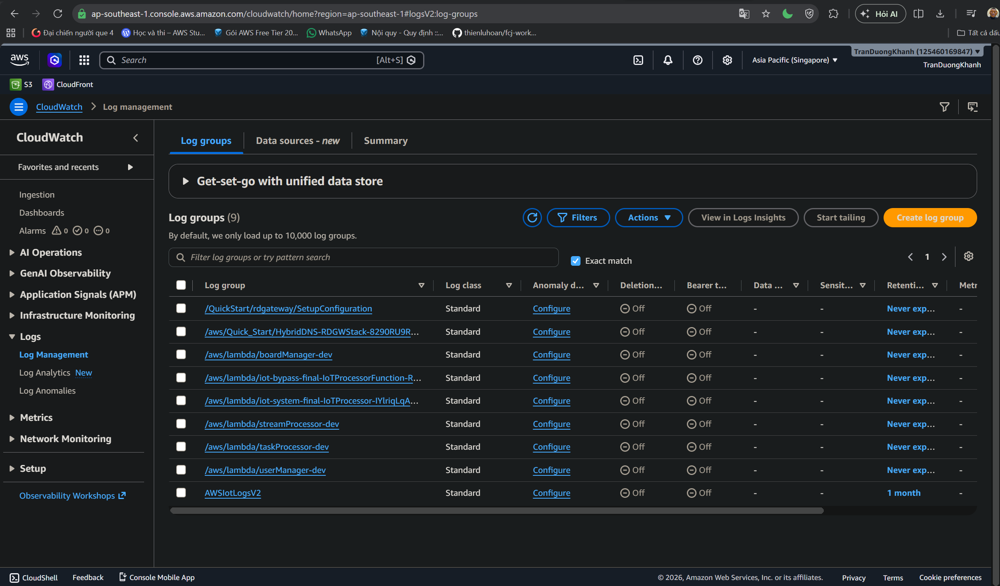

### Goal
Review Amazon CloudWatch log groups to confirm that the backend has an operational logging destination.

### Check Log groups

1. Open the Amazon CloudWatch console.
2. Go to Logs > Log groups.
3. Search for log groups related to TaskManager.

Important log groups in the screenshot:

- `/aws/lambda/userManager-dev`
- `/aws/lambda/boardManager-dev`
- `/aws/lambda/taskProcessor-dev`
- `/aws/lambda/streamProcessor-dev`

### Meaning

CloudWatch helps you:

- Inspect errors when AppSync invokes Lambda.
- Track backend requests.
- Debug task creation or update logic.
- Review log streams for individual Lambda invocations.
- Configure retention to control log storage cost.

### Conclusion

CloudWatch contains log groups for the Lambda backend. This is the foundation for monitoring, troubleshooting, and operating the TaskManager system.

