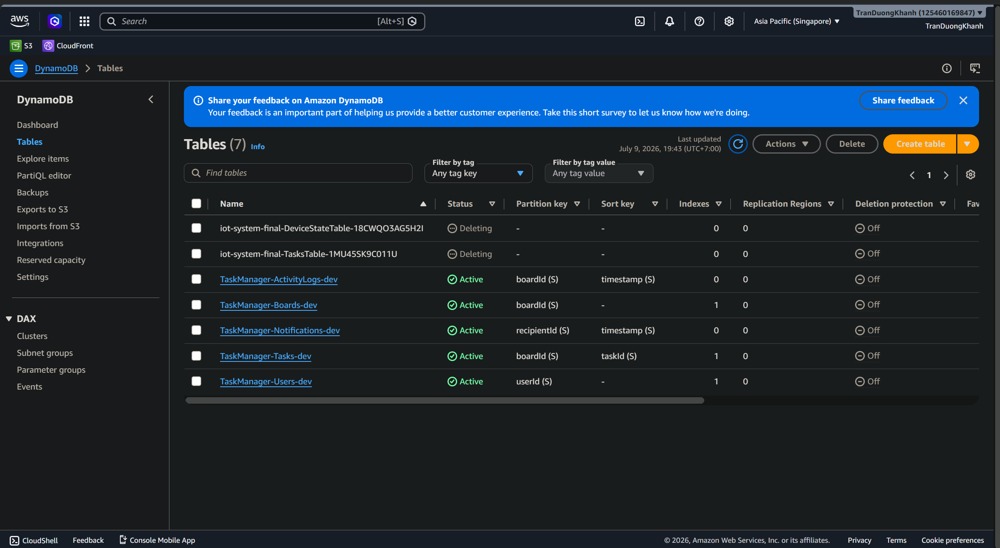
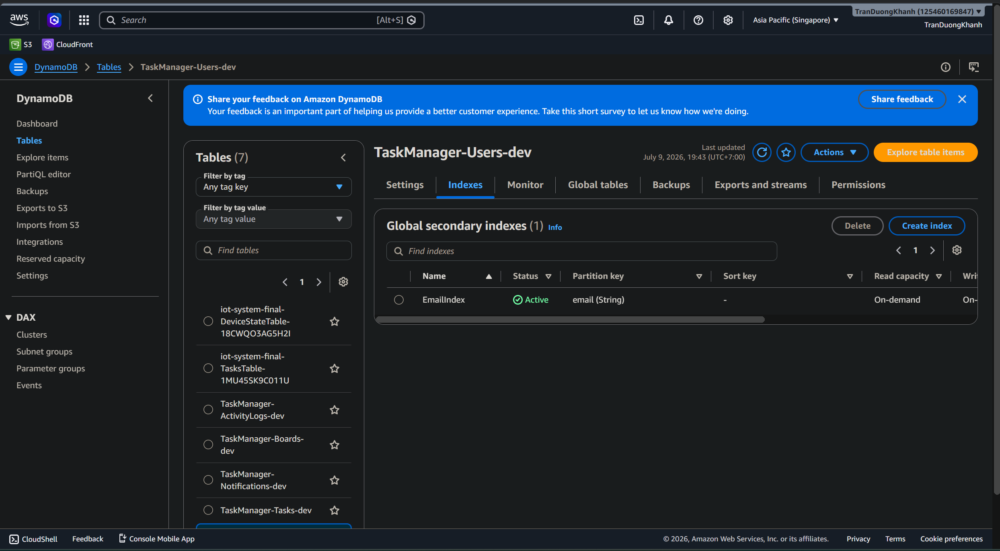
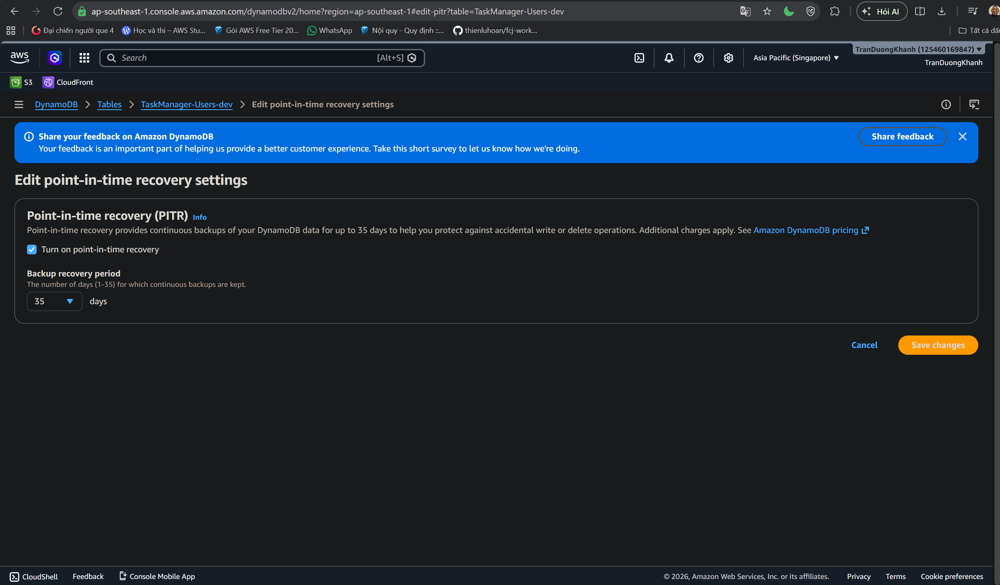
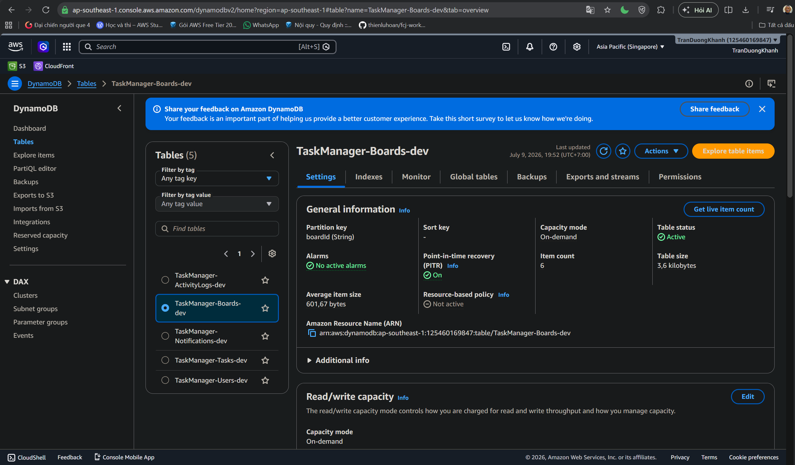
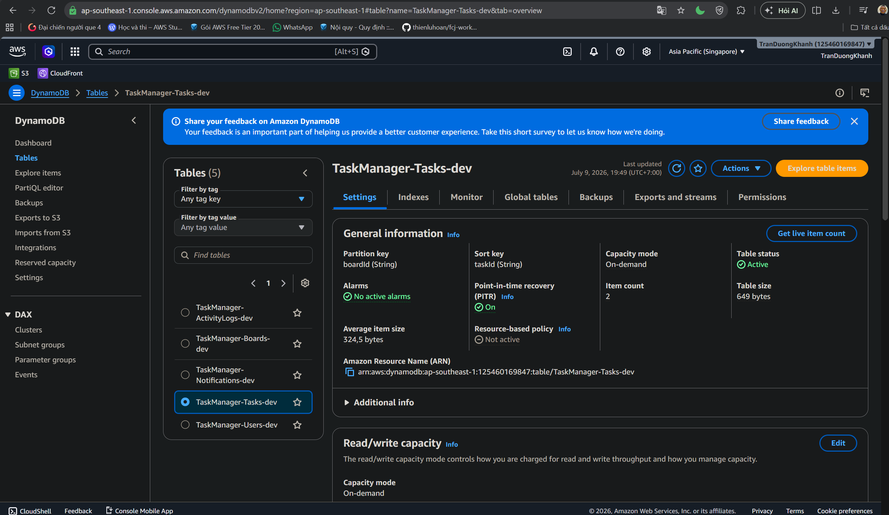
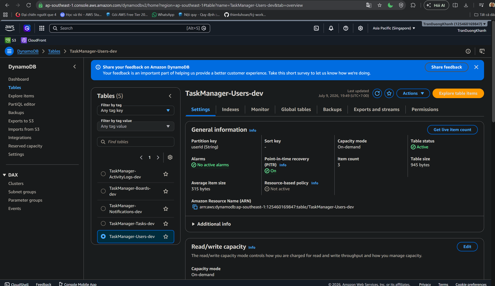

### Mục tiêu

Phần này kiểm tra các bảng DynamoDB, index phục vụ truy vấn và cấu hình Point-in-Time Recovery (PITR) của hệ thống TaskManager.

### Kiểm tra các bảng DynamoDB

1. Mở Amazon DynamoDB Console.
2. Chọn **Tables**.
3. Kiểm tra các bảng có tiền tố `TaskManager`.

Các bảng chính:

- `TaskManager-ActivityLogs-dev`
- `TaskManager-Boards-dev`
- `TaskManager-Notifications-dev`
- `TaskManager-Tasks-dev`
- `TaskManager-Users-dev`

Các bảng đều ở trạng thái **Active** và sử dụng chế độ dung lượng **On-demand**. Chế độ này phù hợp với các hệ thống có khối lượng công việc nhỏ hoặc không ổn định vì không cần cấu hình thủ công dung lượng đọc và ghi.

### Kiểm tra Global Secondary Index

Mở bảng `TaskManager-Users-dev` và chọn tab **Indexes**.

Bảng `TaskManager-Users-dev` có Global Secondary Index như sau:

- Index name: `EmailIndex`
- Partition key: `email`
- Trạng thái: `Active`
- Chế độ dung lượng: On-demand

Index này cho phép hệ thống tìm kiếm người dùng theo địa chỉ email một cách hiệu quả mà không cần quét toàn bộ bảng.

### Kiểm tra PITR trên các bảng quan trọng

Point-in-Time Recovery cho phép DynamoDB duy trì các bản sao lưu liên tục trong tối đa 35 ngày. Tính năng này hữu ích khi dữ liệu bị cập nhật hoặc xóa nhầm.

*Bật PITR*

Trang cấu hình **Edit point-in-time recovery** cho thấy PITR đã được bật với thời gian khôi phục bản sao lưu là 35 ngày.

*Bảng Board*

`TaskManager-Boards-dev`:

- Partition key: `boardId`
- Chế độ dung lượng: On-demand
- Trạng thái bảng: Active
- PITR: On

*Bảng Task*

`TaskManager-Tasks-dev`:

- Partition key: `boardId`
- Sort key: `taskId`
- Chế độ dung lượng: On-demand
- Trạng thái bảng: Active
- PITR: On

*Bảng User*

`TaskManager-Users-dev`:

- Partition key: `userId`
- Chế độ dung lượng: On-demand
- Trạng thái bảng: Active
- PITR: On

### Kết luận

DynamoDB đã được cấu hình phù hợp cho hệ thống TaskManager. Các bảng được phân chia theo từng nhóm dữ liệu, index tìm kiếm người dùng theo email đã được tạo, chế độ dung lượng On-demand được sử dụng và PITR được bật để bảo vệ dữ liệu của các bảng quan trọng.