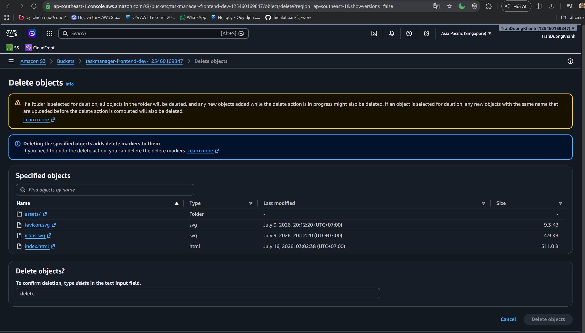
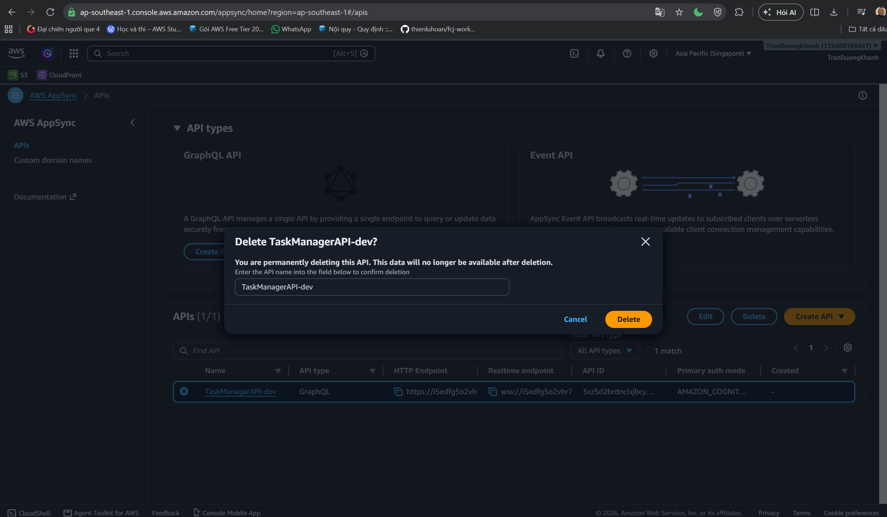
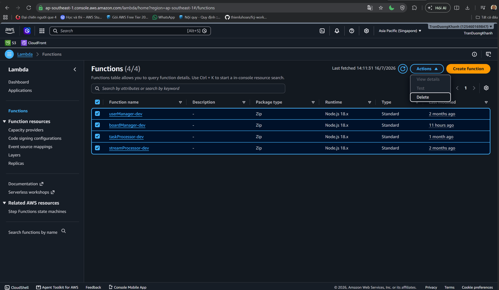
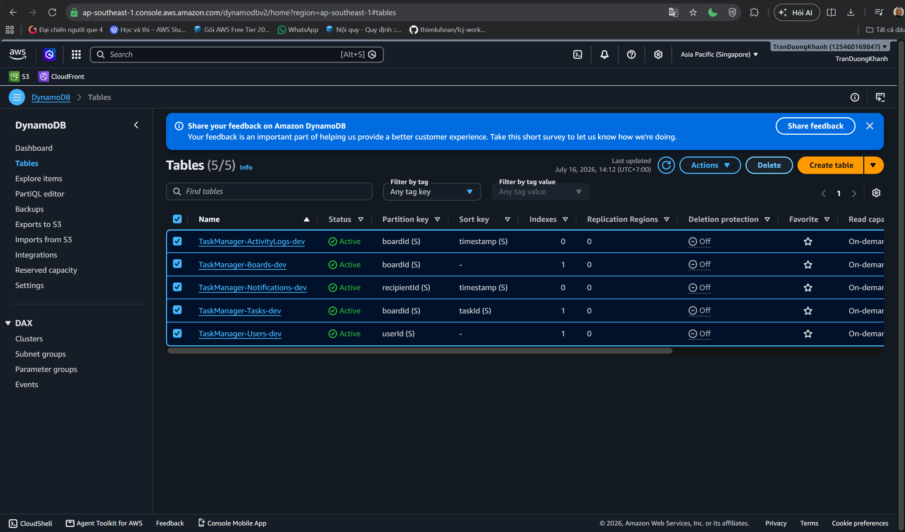
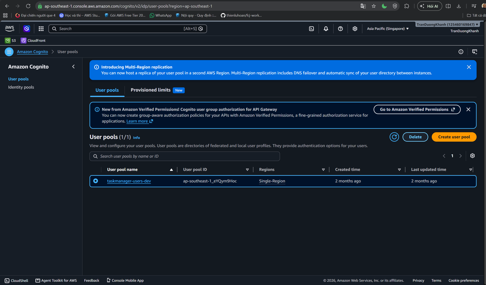
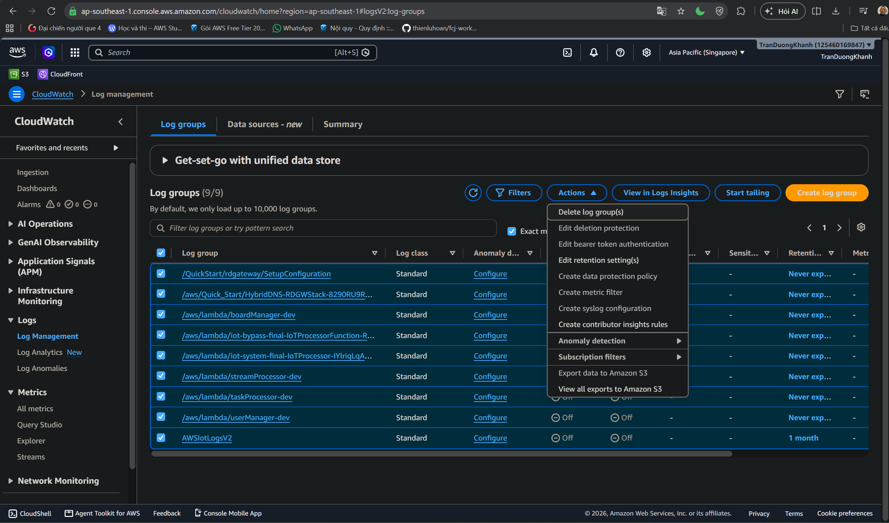
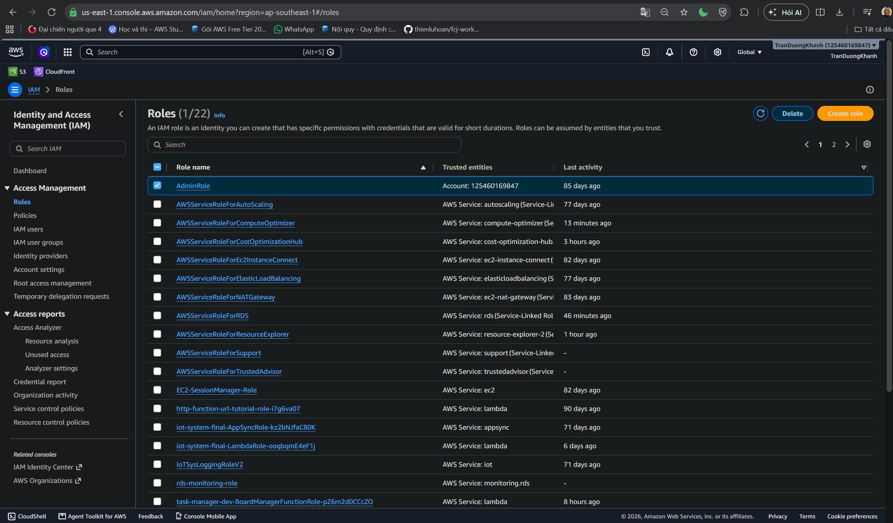

#### Workshop summary

Congratulations, you have completed the TaskManager workshop. In this workshop, you validated:

- IAM dashboard and basic security recommendations.
- S3 bucket containing the frontend build output.
- Cognito User Pool `taskmanager-users-dev`.
- AppSync GraphQL API `TaskManagerAPI-dev`.
- Lambda functions for backend logic.
- DynamoDB tables, Global Secondary Index, and PITR.
- CloudWatch log groups for the Lambda backend.

#### Clean up resources

If you no longer need the TaskManager environment, clean up resources to avoid additional cost.

1. Delete frontend objects in the `taskmanager-frontend-dev-*` S3 bucket.

  

2. Delete the `TaskManagerAPI-dev` AppSync API.

3. Delete Lambda functions `userManager-dev`, `boardManager-dev`, `taskProcessor-dev`, and `streamProcessor-dev`.

4. Delete `TaskManager-*` DynamoDB tables if the data is no longer needed.

5. Delete the `taskmanager-users-dev` Cognito User Pool.

6. Delete CloudWatch log groups `/aws/lambda/*Manager-dev`, `/aws/lambda/taskProcessor-dev`, and `/aws/lambda/streamProcessor-dev` if audit logs are no longer needed.

7. Delete IAM roles or policies created only for this project if they are no longer used.

{}
Before deleting DynamoDB tables or the Cognito User Pool, make sure the data is no longer required. PITR only helps within the configured recovery window when restore is handled correctly.
{}

#### Conclusion

TaskManager is a complete example of a serverless application on AWS: static frontend hosting, managed authentication, GraphQL API, Lambda compute, DynamoDB database, and CloudWatch observability.